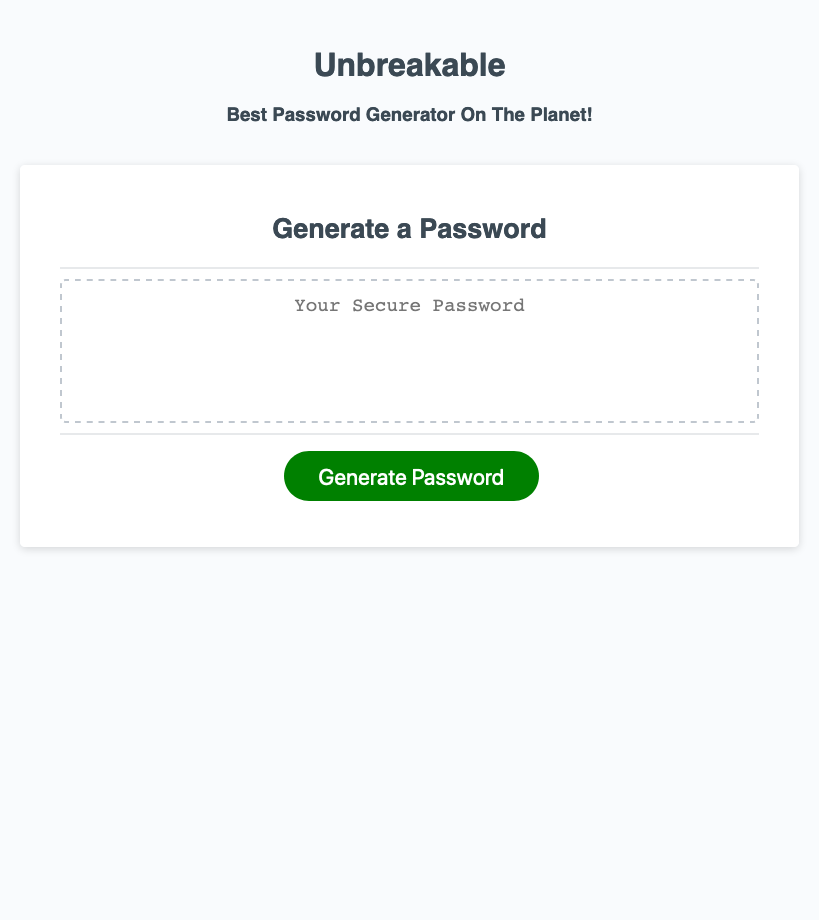

# UNBREAKBLE 
{link for website}

# Technologies Used
1: HTML
2. CSS
3. JavaScript

# Summary
The best password generator on the world wide web! 

Are you concerned about hackers getting access to your abundance of online accounts that withhold a plethera of your private information? 

Unbreakable is the password generator for you! 

Unbreakable will ask you certain questions to come up with the criteria for your password.

" Do you want lower case letters? Upper case letters? Numbers? Or special characters? "  

You can have all of these options or just one for your password as long as your password is between 8 and 128 characters! 

*** The Code ***
More details about how the code operates in the comments in the js.script file. 

*** Screenshot ***

*** Contributors & Support *** 
My tutor Kris Renaldi 
Aren Salmela -- https://github.com/arensalmela
Eddie Phi -- https://github.com/EddiePhi
Sarah Manter -- https://github.com/smanter82

-----------------------------------------
